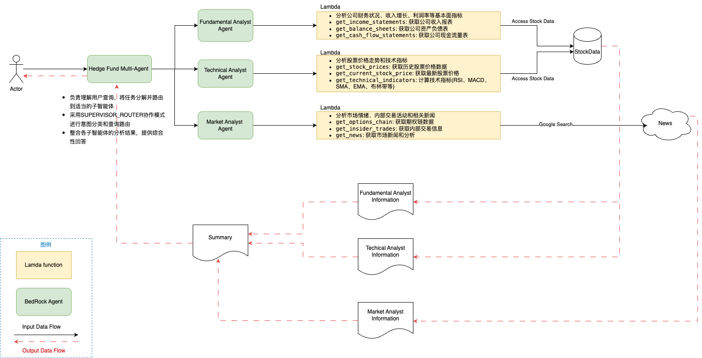

# AI对冲基金多Agent系统

基于Amazon Bedrock Agents实现的AI对冲基金多Agent系统，类似于[ai-hedge-fund](https://github.com/virattt/ai-hedge-fund)项目。该系统使用多个专业Agent协作，为股票投资提供分析和建议。

## 系统架构



系统包含以下组件：

1. **投资专家Agent**
   - Warren Buffett Agent - 价值投资专家
   - Bill Ackman Agent - 积极投资者
   - Charlie Munger Agent - 多学科思维模型专家

2. **分析Agent**
   - 估值Agent - 计算股票内在价值
   - 情绪Agent - 分析市场情绪
   - 基本面Agent - 分析公司财务健康状况
   - 技术面Agent - 分析价格图表和技术指标

3. **风险管理Agent** - 评估投资风险并设置头寸限制

4. **投资组合管理Agent** - 整合所有分析并做出最终决策

5. **金融数据Action Group** - 提供股票价格、财务报表和市场情绪数据

6. **自定义编排Lambda** - 控制多Agent协作流程

7. **金融知识库** - 提供金融市场和投资策略知识

## 项目结构

```
bedrock-multi-agent/
├── config/
│   └── api-schemas/
│       └── financial-data-schema.json  # 金融数据API Schema
├── lambda/
│   ├── financial-data/
│   │   └── index.py                    # 金融数据API Lambda函数
│   └── orchestration/
│       └── index.py                    # 自定义编排Lambda函数
└── lib/
    ├── constructs/
    │   ├── knowledge-base.ts           # 金融知识库构造
    │   ├── expert-agents.ts            # 投资专家Agent构造
    │   ├── analysis-agents.ts          # 分析Agent构造
    │   └── portfolio-manager.ts        # 投资组合管理Agent构造
    └── bedrock-multi-agent-stack.ts    # 主堆栈文件
```

## 组件说明

### 1. 金融知识库构造 (knowledge-base.ts)

负责创建S3存储桶和向量知识库，用于存储和检索金融数据。

### 2. 投资专家Agent构造 (expert-agents.ts)

创建多个投资专家Agent，每个专家Agent都有自己的专业知识和投资风格。

### 3. 分析Agent构造 (analysis-agents.ts)

创建多个分析Agent，负责分析股票的不同方面，并提供专业的分析结果。

### 4. 投资组合管理Agent构造 (portfolio-manager.ts)

创建投资组合管理Agent作为主管理者，使用自定义编排协调多个Agent。

### 5. 金融数据API Lambda函数 (financial-data/index.py)

提供金融数据API，包括获取股票价格、财务报表和市场情绪数据。

### 6. 自定义编排Lambda函数 (orchestration/index.py)

实现自定义编排逻辑，协调多个Agent的工作流程。

## 部署和使用

### 前提条件

- 安装AWS CDK: `npm install -g aws-cdk`
- 配置AWS凭证: `aws configure`

### 部署步骤

1. 安装依赖:
   ```bash
   npm install
   ```

2. 编译TypeScript代码:
   ```bash
   npm run build
   ```

3. 部署堆栈:
   ```bash
   npx cdk deploy
   ```

4. 部署完成后，您将获得投资组合管理Agent的ID和别名ID，可以通过AWS控制台或API调用此Agent。

### 使用示例

部署后，您可以通过AWS控制台或API调用投资组合管理Agent，提供股票代码进行分析：

```
分析股票AAPL的投资价值
```

系统将：
1. 调用各个投资专家Agent获取他们的分析
2. 调用分析Agent获取技术指标
3. 调用风险管理Agent评估风险
4. 整合所有信息生成最终投资建议

## 常用命令

* `npm run build`   编译TypeScript代码
* `npm run watch`   监视文件变化并自动编译
* `npm run test`    执行Jest单元测试
* `npx cdk deploy`  部署堆栈到默认AWS账户/区域
* `npx cdk diff`    比较已部署堆栈与当前状态
* `npx cdk synth`   生成CloudFormation模板

## 扩展建议

1. 添加更多投资专家Agent，如Peter Lynch、Cathie Wood等
2. 增强金融数据API，连接真实的金融数据源
3. 改进决策算法，加入机器学习模型
4. 添加历史表现跟踪和回测功能
